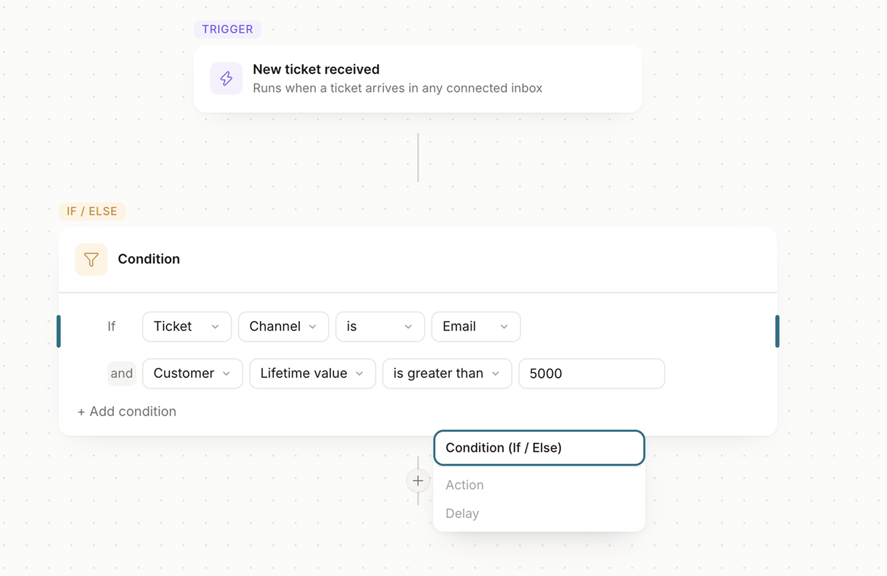
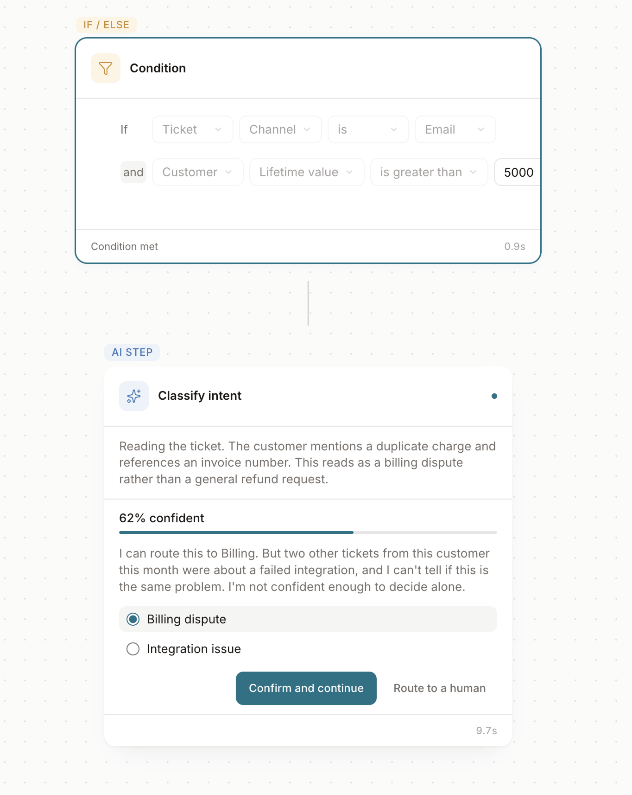
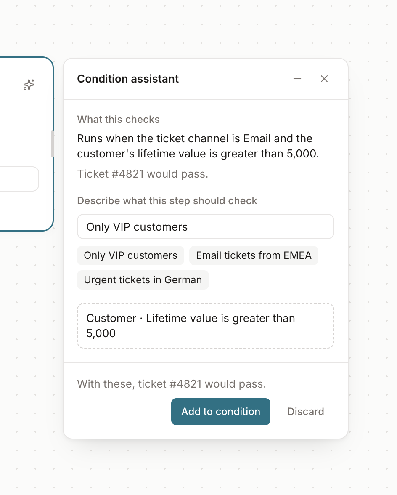

# Workflow canvas

**The question:** what does an interface look like when a system is honest about
not knowing, and hands the decision back to a person?

[Live demo →](https://denys-workflow-canvas.vercel.app/experiments/workflow-canvas)



*Build — conditions you can add, reorder and delete. Nothing is styled as an error until you try to run it.*



*Run — the AI step reaches 62%, says what it is unsure about, and waits.*

## What it is

A support-triage workflow builder with two halves.

**Build.** A trigger and condition steps on a dotted canvas. Add, edit, reorder and
delete conditions. Each step reports whether it is complete, and the flow cannot run
until every step is. A ✦ button on each condition opens an assistant that helps you
write it — more on that below.

**Run.** A Test run mode that executes the flow against one sample ticket in real
elapsed time. Conditions evaluate. An AI step reads the ticket and streams its
reasoning as it goes. Then it reaches 62% confidence — and stops.

It doesn't count down. It doesn't auto-confirm. It states what it is unsure about in
plain sentences, offers two classifications, and waits as long as it takes. The rest
of the flow is visibly blocked until a human answers.

## The decision moment

Most products treat uncertainty as a threshold to cross silently: above the line the
model acts, below it the step fails or falls back. The user sees neither. They find
out what the system decided after it has already decided — usually when something
went wrong downstream.

This prototype designs the other version. At 62% the AI step says why:

> Two other tickets from this customer this month were about a failed integration,
> and I can't tell if this is the same problem. I'm not confident enough to decide
> alone.

A percentage on its own is a number, not a reason. Both proposed labels are visible
without interaction, because the person is comparing — not picking from a menu.

## Four decisions I'd defend

**1. Two colour languages, strictly separated.**
Soft type tints say what a step *is* — trigger, condition, AI step. One saturated
accent says what the system is *doing* — selection, focus, progress, uncertainty.
Neither borrows from the other. By the twelfth node type, a palette that codes both
has stopped meaning anything.

**2. The conjunction belongs to the node, not the row.**
Letting people mix `and` / `or` inside one flat list produces logic whose meaning
depends on precedence rules nobody can see. Set once per node, the logic a user reads
is the logic that runs.

**3. Incomplete is not an error.**
A half-built condition is a normal state of a flow being built, so it isn't styled as
a failure. No red borders, no warning icons while someone is mid-thought — a quiet
marker in the node footer and a count in the top bar. Errors are for when you try to
run it.

**4. The system doesn't take credit for a decision it refused to make.**
Whatever the person chooses is recorded as theirs: *"Classified as Billing dispute ·
confirmed by you."* An interface that asks for help and then quietly absorbs the
outcome teaches people that asking was theatre.

## What I found by building it

The waiting state turned out to be the only looping animation in the whole prototype.
Everything else has a start and an end. The one state with no deadline is the only one
that never stops moving. I didn't plan that — a static comp could not have shown it to
me.

## Deliberately not built

Zoom · minimap · true If/Else branching with two outgoing paths · multiple triggers ·
persistence · real model calls · dark mode · a node library · a properties panel.

Each of those is a real feature. None of them helps answer the question above, and the
list of things I chose not to build is part of the work.

## What I'd test next

62% is arbitrary — a number that reads as clearly unsure without being useless. The
design problem I actually want to solve is who sets that threshold, how a team tunes
"decide alone" versus "ask me" per workflow, and whether that setting is still legible
six months later.

My prediction: teams set it once and never revisit it, which means the interface has to
surface the drift on its own.

## The assistant — honest at build time too

The AI step is honest at run time. The same question applies earlier: when an
assistant helps you *build* the flow, does it guess, or does it ask?



*Build — the assistant reads the condition back in plain words and shows a suggestion as a draft, with its effect on the sample ticket, before anything changes.*

Click ✦ on a condition step. The assistant:

- **Reads the condition back in plain words** — *"Runs when the ticket channel is
  Email and the customer's lifetime value is greater than 5,000"* — and says whether
  the sample ticket would pass.
- **Asks instead of guessing.** "Only VIP customers" could mean lifetime value or plan.
  It says it can't tell which one you mean, and asks.
- **Shows consequences before anything changes.** Suggestions appear as drafts and are
  never applied silently. Pick "Plan is Enterprise" and it warns you the sample ticket
  won't pass anymore.
- **Says when it can't help.** Ask for something it has no field for, and it lists the
  fields it knows instead of inventing one.
- **Leaves the authorship with you.** When you add a suggestion, it says *Added by
  you* — not "I added".

It sits next to the step it's about and moves with it, rather than living in a side
panel. On a canvas, position carries meaning: a floating window covers the work and
fights the pan.

The assistant is scripted — a keyword matcher, not a model. The point is the
behaviour, not the language understanding.

## What the comments changed

I posted this on LinkedIn and people pushed on it. Two changes so far.

**The wait goes still.** Someone asked whether "waiting for you" still reads that way after five minutes, or starts to feel broken. I had never let it run past one. My guess was that motion has a shelf life, so now, after a minute, the pulse stops and the step says *Waiting since 14:02* instead. Stillness reads as patience. Movement reads as stuck.

Building it turned up a second moving thing I hadn't counted: the step's timer, ticking every tenth of a second. That had to stop too. So the only looping animation in the prototype now has an end as well.

**Mobile.** On an iPhone you couldn't reach the right edge of a node. The canvas pans on narrow screens now. It's a bandaid — the canvas was never designed for a phone, and a real fix isn't part of the question this prototype asks.

**Next.** One blocked flow waiting for a person is honest. Forty of them is a queue nobody looks at. That's the next experiment.

## Running it

```bash
npm install
npm run dev
# → http://localhost:3000/experiments/workflow-canvas
```

Add `?still=5` to the URL to make the waiting state go still after 5 seconds instead of 60 — handy for recording.

Built in my own time. Fake data throughout, no production code and nothing proprietary
— just enough to feel the interaction.
